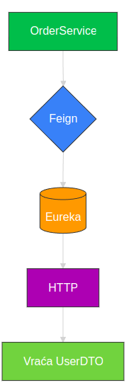
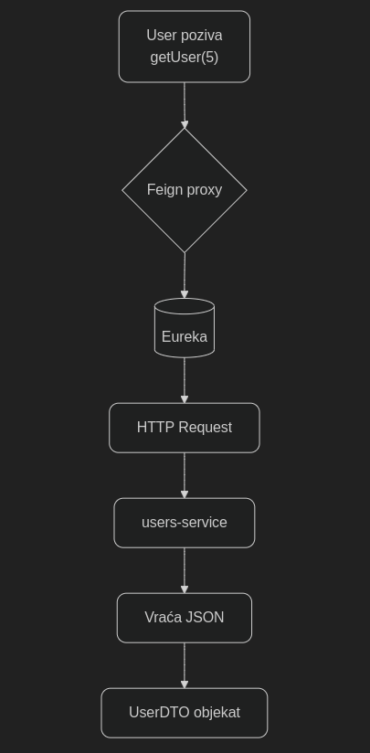
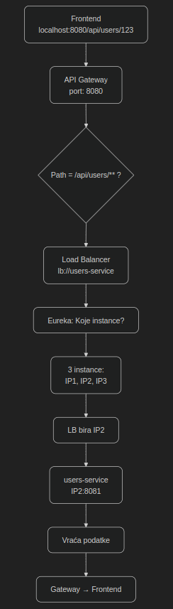
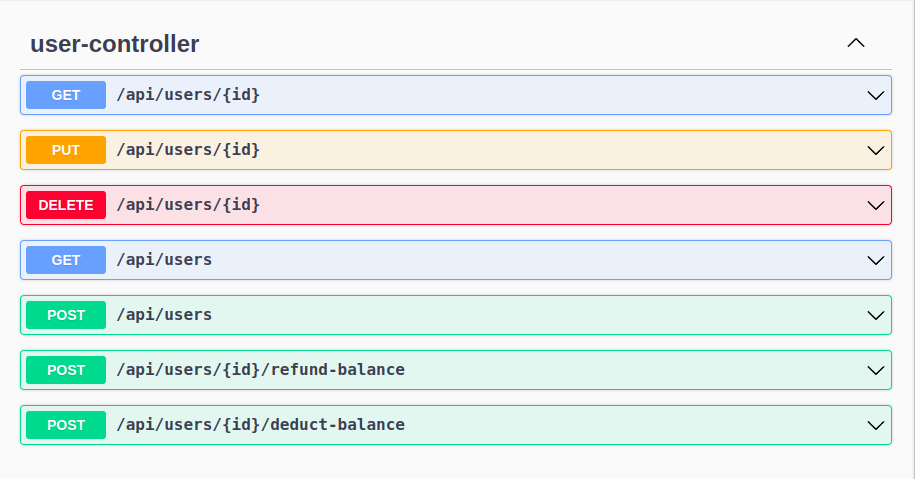
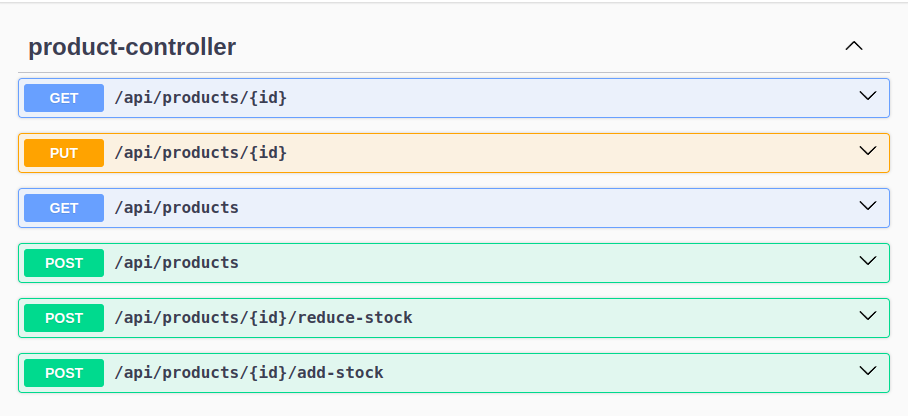
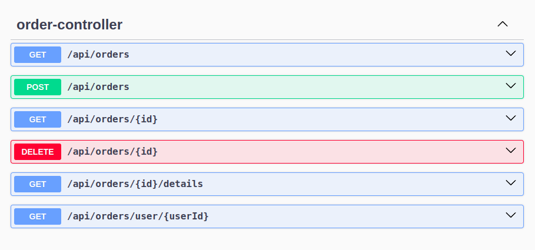
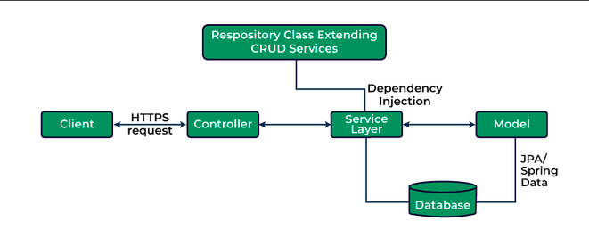

## 🧱 Arhitektura

- **Eureka Service (Service Discovery)**
- **Users Service** – evidencija korisnika i njihovog balansa
- **Products Service** – evidencija proizvoda i dostupne količine
- **Orders Service** – kreiranje porudžbina (komunikacija sa Users i Products)
- (Opcioni) **API Gateway** – jedinstvena ulazna tačka

Komunikacija između servisa se vrši preko **OpenFeign**.
Otpornost sistema obezbeđena je korišćenjem **Resilience4j** (Circuit Breaker + Retry).

## ▶️ Pokretanje

Pokretanje u ispravnom redosledu:

1. **Eureka Server** →  `http://localhost:8761`
2. **Users Service** →  `http://localhost:8081`
3. **Products Service** →  `http://localhost:8082`
4. **Orders Service** →  `http://localhost:8083`
5. **API Gateway** (opciono) →  `http://localhost:8080`

## REST API Endpoints

| Servis           | Endpoint Base URL                    | Swagger UI                           |
|------------------|--------------------------------------|-------------------------------------|
| users-service    | `http://localhost:8081/api/users`    | `http://localhost:8081/swagger-ui.html` |
| products-service | `http://localhost:8082/api/products` | `http://localhost:8082/swagger-ui.html` |
| orders-service   | `http://localhost:8083/api/orders`   | `http://localhost:8083/swagger-ui.html` |

## Architecture Diagrams and Screenshots

### Feign Flow

  
  
  

### Gateway

  
  

### APIs
#### User API

#### Product API

#### Order API

#### Screenshot

